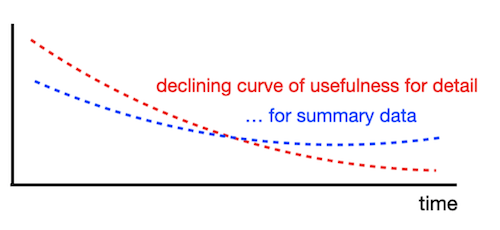

# Day 07 - Piscine SQL

## _Aggregated data is more informative, isn't it?_

Resume: Today you will see how to use specific OLAP constructions to get a "Value" from data.

## Contents

1. [Chapter I](#chapter-i) \
    1.1. [Preamble](#preamble)
2. [Chapter II](#chapter-ii) \
    2.1. [General Rules](#general-rules)
3. [Chapter III](#chapter-iii) \
    3.1. [Rules of the day](#rules-of-the-day)  
4. [Chapter IV](#chapter-iv) \
    4.1. [Exercise 00 - Simple aggregated information](#exercise-00-simple-aggregated-information)  
5. [Chapter V](#chapter-v) \
    5.1. [Exercise 01 - Let’s see real names](#exercise-01-lets-see-real-names)  
6. [Chapter VI](#chapter-vi) \
    6.1. [Exercise 02 - Restaurants statistics](#exercise-02-restaurants-statistics)  
7. [Chapter VII](#chapter-vii) \
    7.1. [Exercise 03 - Restaurants statistics #2](#exercise-03-restaurants-statistics-2)  
8. [Chapter VIII](#chapter-viii) \
    8.1. [Exercise 04 - Clause for groups](#exercise-04-clause-for-groups)
9. [Chapter IX](#chapter-ix) \
    9.1. [Exercise 05 - Person's uniqueness](#exercise-05-persons-uniqueness)
10. [Chapter X](#chapter-x) \
    10.1. [Exercise 06 - Restaurant metrics](#exercise-06-restaurant-metrics)
11. [Chapter XI](#chapter-xi) \
    11.1. [Exercise 07 - Average global rating](#exercise-07-average-global-rating)
12. [Chapter XII](#chapter-xii) \
    12.1. [Exercise 08 - Find pizzeria’s restaurant locations](#exercise-08-find-pizzerias-restaurant-locations)    
13. [Chapter XIII](#chapter-xiii) \
    13.1. [Exercise 09 - Explicit type transformation](#exercise-09-explicit-type-transformation)        

## Chapter I
## Preamble

For detailed data over time, see the Curve of Usefulness. In other words, detailed data (i.e. user transactions, facts about products and providers, etc.) is not useful to us from a historical perspective, because we only need to know some aggregation to describe what was going on a year ago.

Why is this happening? The reason lies in our analytical mind. Actually, we want to focus on our business strategy from a historical perspective to set new business goals, and we don't need the details. 

From a database point of view, "Analytical mind" corresponds to OLAP traffic (information layer), "details" corresponds to OLTP traffic (raw data layer). Today, there is a more flexible pattern for storing detailed data and aggregated information in the ecosystem. I am talking about `LakeHouse = DataLake + DataWareHouse`.

If we are talking about historical data, then we should mention the "Data Lifecycle Management" pattern. In simple words, what should we do with old data? TTL (time-to-live), SLA for data, Retention Data Policy, etc. are terms used in Data Governance strategy.

## Chapter II
## General Rules

- Use this page as your only reference. Do not listen to rumors and speculations about how to prepare your solution.
- Make sure you are using the latest version of PostgreSQL.
- It is perfectly fine if you use the IDE to write source code (aka SQL script).
- To be evaluated, your solution must be in your GIT repository.
- Your solutions will be evaluated by your peers.
- You should not leave any files in your directory other than those explicitly specified by the exercise instructions. It is recommended that you modify your `.gitignore` to avoid accidents.
- Got a question? Ask your neighbor to the right. Otherwise, try your neighbor on the left.
- Your reference manual: mates / Internet / Google. 
- Read the examples carefully. You may need things not specified in the topic.
- And may the SQL-Force be with you!
Absolutely anything can be represented in SQL! Let's get started and have fun!

## Chapter III
## Rules of the day

- Please make sure you have your own database and access to it on your PostgreSQL cluster. 
- Please download a [script](materials/model.sql) with Database Model here and apply the script to your database (you can use command line with psql or just run it through any IDE, for example DataGrip from JetBrains or pgAdmin from PostgreSQL community). **Our knowledge way is incremental and linear therefore please be aware all changes that you made in Day03 during Exercises 07-13 and in Day04 during Exercise 07 should be on place (its similar like in real world , when we applied a release and need to be consistency with data for new changes).**
- All tasks contain a list of Allowed and Denied sections with listed database options, database types, SQL constructions etc. Please have a look at the section before you start.
- Please take a look at the Logical View of our Database Model. 

1. **pizzeria** table (Dictionary Table with available pizzerias)
- field id - primary key
- field name - name of pizzeria
- field rating - average rating of pizzeria (from 0 to 5 points)
2. **person** table (Dictionary Table with persons who loves pizza)
- field id - primary key
- field name - name of person
- field age - age of person
- field gender - gender of person
- field address - address of person
3. **menu** table (Dictionary Table with available menu and price for concrete pizza)
- field id - primary key
- field pizzeria_id - foreign key to pizzeria
- field pizza_name - name of pizza in pizzeria
- field price - price of concrete pizza
4. **person_visits** table (Operational Table with information about visits of pizzeria)
- field id - primary key
- field person_id - foreign key to person
- field pizzeria_id - foreign key to pizzeria
- field visit_date - date (for example 2022-01-01) of person visit 
5. **person_order** table (Operational Table with information about persons orders)
- field id - primary key
- field person_id - foreign key to person
- field menu_id - foreign key to menu
- field order_date - date (for example 2022-01-01) of person order 

People's visit and people's order are different entities and don't contain any correlation between data. For example, a customer can be in a restaurant (just looking at the menu) and at the same time place an order in another restaurant by phone or mobile application. Or another case, just be at home and again make a call with order without any visits.

## Chapter IV
## Exercise 00 - Simple aggregated information

| Exercise 00: Simple aggregated information |                                                                                                                          |
|---------------------------------------|--------------------------------------------------------------------------------------------------------------------------|
| Turn-in directory                     | ex00                                                                                                                     |
| Files to turn-in                      | `day07_ex00.sql`                                                                                 |
| **Allowed**                               |                                                                                                                          |
| Language                        | ANSI SQL|

Let's make a simple aggregation, please write a SQL statement that returns person identifiers and corresponding number of visits in any pizzerias and sorts by number of visits in descending mode and sorts by `person_id` in ascending mode. Please take a look at the sample of data below.

| person_id | count_of_visits |
| ------ | ------ |
| 9 | 4 |
| 4 | 3 |
| ... | ... | 

## Chapter V
## Exercise 01 - Let’s see real names

| Exercise 01: Let’s see real names|                                                                                                                          |
|---------------------------------------|--------------------------------------------------------------------------------------------------------------------------|
| Turn-in directory                     | ex01                                                                                                                     |
| Files to turn-in                      | `day07_ex01.sql`                                                                                 |
| **Allowed**                               |                                                                                                                          |
| Language                        | ANSI SQL                                                                                              |

Please modify an SQL statement from Exercise 00 and return a person name (not an identifier). Additional clause is we need to see only top 4 people with maximum visits in each pizzerias and sorted by a person name. See the example of output data below.

| name | count_of_visits |
| ------ | ------ |
| Dmitriy | 4 |
| Denis | 3 |
| ... | ... | 

## Chapter VI
## Exercise 02 - Restaurants statistics

| Exercise 02: Restaurants statistics|                                                                                                                          |
|---------------------------------------|--------------------------------------------------------------------------------------------------------------------------|
| Turn-in directory                     | ex02                                                                                                                     |
| Files to turn-in                      | `day07_ex02.sql`                                                                                 |
| **Allowed**                               |                                                                                                                          |
| Language                        | ANSI SQL                                                                                              |

Please write a SQL statement to see 3 favorite restaurants by visits and by orders in a list (please add an action_type column with values 'order' or 'visit', it depends on the data from the corresponding table). Please have a look at the example data below. The result should be sorted in ascending order by the action_type column and in descending order by the count column.

| name | count | action_type |
| ------ | ------ | ------ |
| Dominos | 6 | order |
| ... | ... | ... |
| Dominos | 7 | visit |
| ... | ... | ... |

## Chapter VII
## Exercise 03 - Restaurants statistics #2

| Exercise 03: Restaurants statistics #2 |                                                                                                                          |
|---------------------------------------|--------------------------------------------------------------------------------------------------------------------------|
| Turn-in directory                     | ex03                                                                                                                     |
| Files to turn-in                      | `day07_ex03.sql`                                                                                 |
| **Allowed**                               |                                                                                                                          |
| Language                        | ANSI SQL                                                                                              |

Write an SQL statement to see how restaurants are grouped by visits and by orders, and joined together by restaurant name.  
You can use the internal SQL from Exercise 02 (Restaurants by Visits and by Orders) without any restrictions on the number of rows.

In addition, add the following rules.
- Compute a sum of orders and visits for the corresponding pizzeria (note that not all pizzeria keys are represented in both tables).
- Sort the results by the `total_count` column in descending order and by the `name` column in ascending order.
Take a look at the example data below.

| name | total_count |
| ------ | ------ |
| Dominos | 13 |
| DinoPizza | 9 |
| ... | ... | 

## Chapter VIII
## Exercise 04 - Clause for groups

| Exercise 04: Clause for groups |                                                                                                                          |
|---------------------------------------|--------------------------------------------------------------------------------------------------------------------------|
| Turn-in directory                     | ex04                                                                                                                     |
| Files to turn-in                      | `day07_ex04.sql`                                                                                 |
| **Allowed**                               |                                                                                                                          |
| Language                        | ANSI SQL                                                                                              |
| **Denied**                               |                                                                                                                          |
| Syntax construction                        | `WHERE`                                                                                              |

Please write a SQL statement that returns the person's name and the corresponding number of visits to any pizzerias if the person has visited more than 3 times (> 3). Please take a look at the sample data below.

| name | count_of_visits |
| ------ | ------ |
| Dmitriy | 4 |

## Chapter IX
## Exercise 05 - Person's uniqueness

| Exercise 05: Person's uniqueness|                                                                                                                          |
|---------------------------------------|--------------------------------------------------------------------------------------------------------------------------|
| Turn-in directory                     | ex05                                                                                                                     |
| Files to turn-in                      | `day07_ex05.sql`                                                                                 |
| **Allowed**                               |                                                                                                                          |
| Language                        |  ANSI SQL                                                                                              |
| **Denied**                               |                                                                                                                          |
| Syntax construction                        |  `GROUP BY`, any type (`UNION`,...) working with sets                                                                                              |

Please write a simple SQL query that returns a list of unique person names who have placed orders at any pizzerias. The result should be sorted by person name. Please see the example below.

| name | 
| ------ |
| Andrey |
| Anna | 
| ... | 

## Chapter X
## Exercise 06 - Restaurant metrics

| Exercise 06: Restaurant metrics|                                                                                                                          |
|---------------------------------------|--------------------------------------------------------------------------------------------------------------------------|
| Turn-in directory                     | ex06                                                                                                                     |
| Files to turn-in                      | `day07_ex06.sql`                                                                                 |
| **Allowed**                               |                                                                                                                          |
| Language                        | ANSI SQL                                                                                              |

Please write a SQL statement that returns the number of orders, the average price, the maximum price and the minimum price for pizzas sold by each pizzeria restaurant. The result should be sorted by pizzeria name. See the sample data below. 
Round the average price to 2 floating numbers.

| name | count_of_orders | average_price | max_price | min_price |
| ------ | ------ | ------ | ------ | ------ |
| Best Pizza | 5 | 780 | 850 | 700 |
| DinoPizza | 5 | 880 | 1000 | 800 |
| ... | ... | ... | ... | ... |

## Chapter XI
## Exercise 07 - Average global rating

| Exercise 07: Average global rating|                                                                                                                          |
|---------------------------------------|--------------------------------------------------------------------------------------------------------------------------|
| Turn-in directory                     | ex07                                                                                                                     |
| Files to turn-in                      | `day07_ex07.sql`                                                                                 |
| **Allowed**                               |                                                                                                                          |
| Language                        | ANSI SQL                                                                                              |

Write an SQL statement that returns a common average rating (the output attribute name is global_rating) for all restaurants. Round your average rating to 4 floating point numbers.

## Chapter XII
## Exercise 08 - Find pizzeria’s restaurant locations

| Exercise 08: Find pizzeria’s restaurant locations|                                                                                                                          |
|---------------------------------------|--------------------------------------------------------------------------------------------------------------------------|
| Turn-in directory                     | ex08                                                                                                                     |
| Files to turn-in                      | `day07_ex08.sql`                                                                                 |
| **Allowed**                               |                                                                                                                          |
| Language                        | ANSI SQL                                                                                              |

We know personal addresses from our data. Let's assume that this person only visits pizzerias in his city. Write a SQL statement that returns the address, the name of the pizzeria, and the amount of the person's orders. The result should be sorted by address and then by restaurant name. Please take a look at the sample output data below.

| address | name |count_of_orders |
| ------ | ------ |------ |
| Kazan | Best Pizza |4 |
| Kazan | DinoPizza |4 |
| ... | ... | ... | 

## Chapter XIII
## Exercise 09 - Explicit type transformation

| Exercise 09: Explicit type transformation|                                                                                                                          |
|---------------------------------------|--------------------------------------------------------------------------------------------------------------------------|
| Turn-in directory                     | ex09                                                                                                                     |
| Files to turn-in                      | `day07_ex09.sql`                                                                                 |
| **Allowed**                               |                                                                                                                          |
| Language                        | ANSI SQL                                                                                              |

Please write a SQL statement that returns aggregated information by person's address, the result of "Maximum Age - (Minimum Age / Maximum Age)" presented as a formula column, next is average age per address and the result of comparison between formula and average columns (in other words, if formula is greater than average, then True, otherwise False value).

The result should be sorted by address column. Please take a look at the example of output data below.

| address | formula |average | comparison |
| ------ | ------ |------ |------ |
| Kazan | 44.71 |30.33 | true |
| Moscow | 20.24 | 18.5 | true |
| ... | ... | ... | ... |

